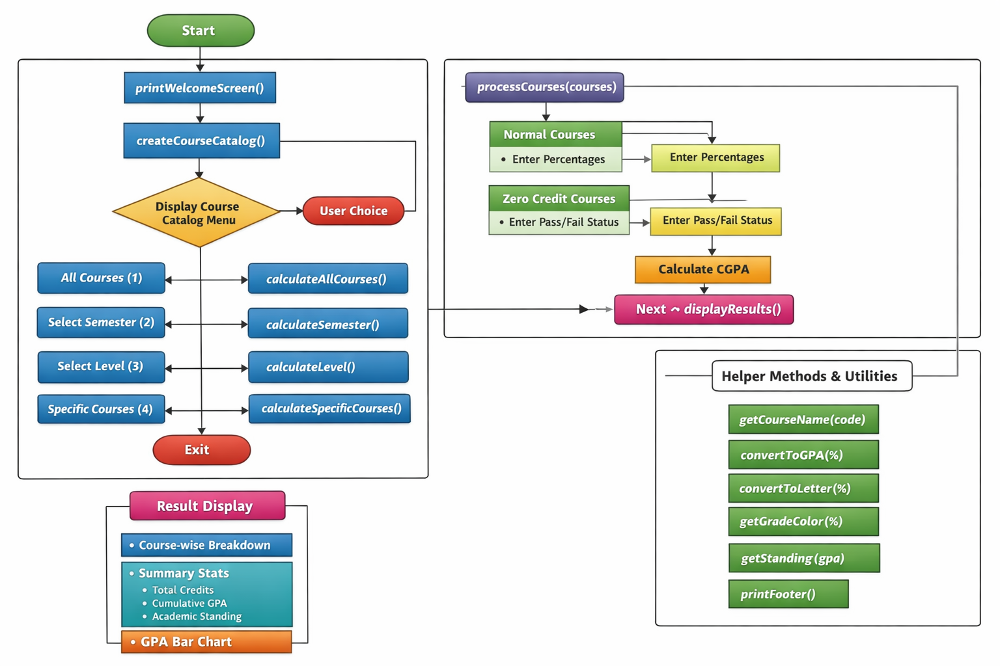

# 🎓 FCAI-CU GPA Calculator

A fully interactive, console-based GPA & CGPA Calculator built in Java for FCAI students.  
The system allows students to calculate GPA by semester, level, specific courses, or all courses, with detailed breakdowns, visualization, and academic standing evaluation.

---

## 🚀 Features

### 📚 Course Selection Options
- Calculate GPA for **All Courses**
- Calculate GPA for a **Specific Semester**
- Calculate GPA for a **Specific Level**
- Calculate GPA for **Custom Selected Courses**
- Support for **Zero Credit (Pass/Fail) Courses**

---

### 🧮 GPA Calculation System
- Converts percentage grades to:
    - 🎯 GPA (4.0 scale)
    - 🏅 Letter Grade (A+, A, B+, etc.)
- Weighted GPA calculation:


- Prevents division by zero
- Handles skipped courses and early exit options

---

### 🎨 User Experience Enhancements
- Color-coded grade output
- Console table formatting for professional result display
- GPA Bar Visualization (40-block visual scale)
- Academic Standing classification:
- ممتاز (Excellent)
- جيد جداً (Very Good)
- جيد (Good)
- مقبول (Pass)
- ضعيف (Poor)
- ضعيف جداً (Very Poor)

---

## 🏗️ System Architecture

### 🔹 Core Classes

#### 1️⃣ Course
Represents a single course:
- Code
- Name
- Credits
- Percentage
- Letter Grade
- GPA Points
- Semester
- Level

#### 2️⃣ Semester
Contains:
- Semester number
- Level
- List of Courses

---

### 🔹 Main Functional Modules

| Method | Responsibility |
|--------|---------------|
| `main()` | Controls program flow & menu system |
| `createCourseCatalog()` | Initializes all semesters & courses |
| `displayCourseCatalog()` | Shows structured course catalog |
| `calculateAllCourses()` | Calculates GPA for all courses |
| `calculateSemester()` | Calculates GPA per semester |
| `calculateLevel()` | Calculates GPA per level |
| `calculateSpecificCourses()` | Calculates GPA for selected course codes |
| `processCourses()` | Handles user input, GPA computation & validation |
| `displayResults()` | Displays detailed results table & summary |

---

### 🔹 Helper Methods

| Method | Purpose |
|--------|---------|
| `convertToGPA()` | Converts percentage to GPA (4.0 scale) |
| `convertToLetter()` | Converts percentage to Letter Grade |
| `getCourseName()` | Maps course code to full name |
| `getGradeColor()` | Returns console color for grade |
| `getStanding()` | Determines academic standing |
| `truncateString()` | Maintains table formatting |
| `displayGPAVisualization()` | Displays GPA bar chart |
| `printFooter()` | Displays closing message |

---

## 📊 GPA Scale

| Percentage | GPA | Grade |
|------------|-----|-------|
| 96+        | 4.0 | A+ |
| 92–95      | 3.7 | A |
| 88–91      | 3.4 | A- |
| 84–87      | 3.2 | B+ |
| 80–83      | 3.0 | B |
| 76–79      | 2.8 | B- |
| 72–75      | 2.6 | C+ |
| 68–71      | 2.4 | C |
| 64–67      | 2.2 | C- |
| 60–63      | 2.0 | D+ |
| 55–59      | 1.5 | D |
| 50–54      | 1.0 | D- |
| < 50       | 0.0 | F |

---

## 🖥️ Example Output

- Detailed course-by-course breakdown
- Credit hours summary
- CGPA calculation
- Academic standing
- Visual GPA progress bar

---

## 🛠️ Technologies Used

- Java (JDK 8+)
- Object-Oriented Programming
- Console ANSI Coloring
- Data Structures:
- ArrayList
- HashMap
- LinkedHashMap

---

## 💡 Design Principles Applied

- Separation of Concerns
- Modular Programming
- Input Validation & Error Handling
- Clean Console UI Design
- Reusable Helper Methods


---

## 📊 System Flowchart



---
## 📌 How to Run


1. Clone the repository:
 ```bash
 git clone https://github.com/mohamedabdelmasood624/fcai-gpa-calculator.git


